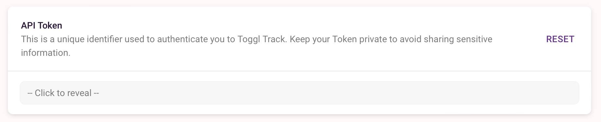

# Companion Module Toggl Track

This module allows you to start and stop [Toggl Track](https://track.toggl.com/) timers.

## Configuration

Before using this module you must create a Toggl Track account. Then go to your Toggl profile settings page and copy the API token. Look for this section on your toggl profile.

Paste this token into the config page of this module and click save. If all is well the module status will turn green.

## Actions

**Start New Timer** 

Start a new timer running with the description set in the action and store the ID. If a list of projects has been retrieved on startup you can choose a project.

**Get Current Timer**

Companion only knows the ID of timers it has started, if a timer is started from another application or the toggle website then this action will get the ID so Companion knows about it.

**Stop Current Timer**

Attempt to stop the current timer. This will fail if Companion doesn't know the ID of the currently running timer.

## Presets

Presets are available for **Start Timer** and **Stop Timer**. The **Stop Timer** preset also includes both the **Get Current Timer** and **Stop Current Timer** actions to ensure reliable operation.

## History

### Version 1.0.0
First release

### Version 1.0.1
Fix broken link

### Version 1.0.2
Allow a project to be specified when starting a new timer button